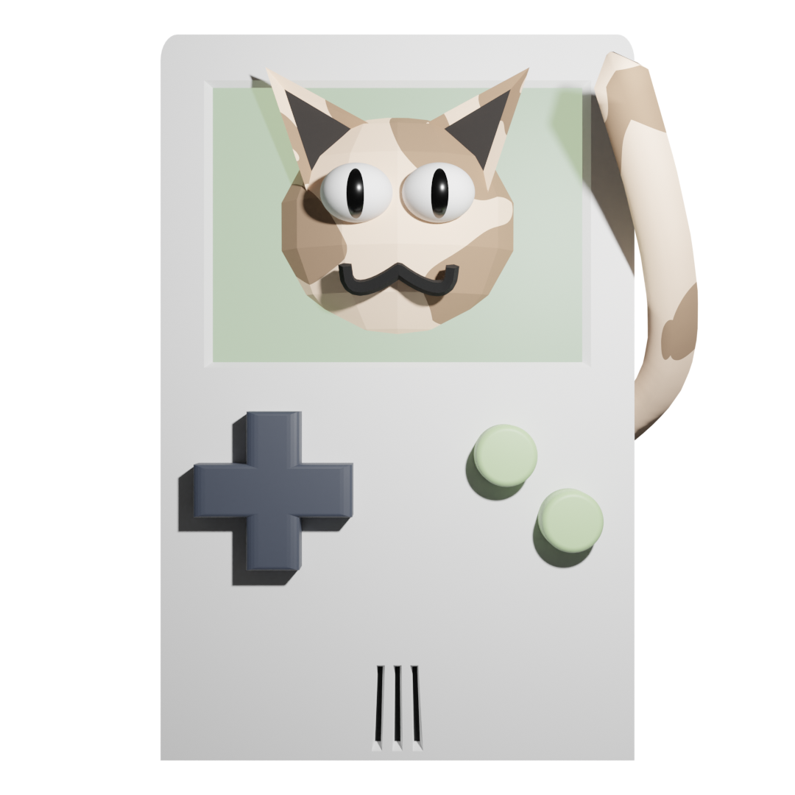

# catboy

a tongue-in-cheek GUI that provides similar functionality to GNU cat

## information:
Attribute | Value
---|---
Development Status: | Active Neglect
Price: | I hope you didn't pay money for this
Donations: | Unwelcome/Unneccesary
Pull Requests: | Scrutinized Heavily
Style Guidelines: | N/A
That's a cute cat! | thanks

